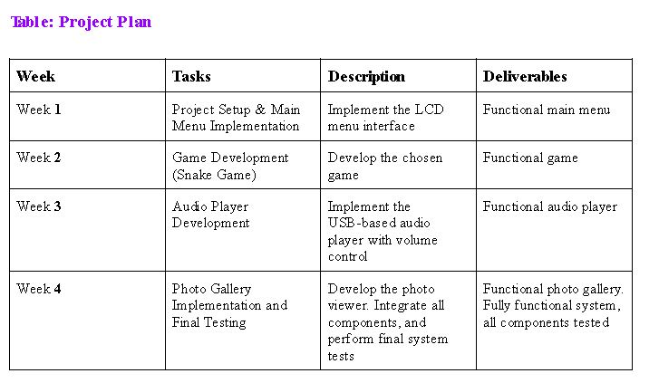

# Embedded Systems Multimedia Project

This project showcases the design and implementation of an embedded system that integrates multimedia, user input, and hardware interfacing. It combines features like a photo viewer, an MP3 player, and games into a unified system.

## Table of Contents
- [Overview](#overview)
- [Features](#features)
- [Project Plan](#project-plan)
- [Flow Diagram](#flow-diagram)
- [Hardware Demonstration](#hardware-demonstration)
- [How to Run](#how-to-run)
- [Code Files](#code-files)
- [Screenshots](#screenshots)

## Overview

This embedded system project demonstrates:
- User interface navigation via joystick
- Multimedia capabilities such as photo viewing and MP3 playback
- Games including Snake and Memory

## Features

1. **Main Menu Navigation**: A clean and intuitive interface for selecting between features.
2. **Snake Game**: A simple but engaging game implemented using the LCD and joystick inputs.
3. **Memory Game**: A challenging game testing the user's memory with graphical feedback.
4. **MP3 Player**: USB-based audio player with volume control.
5. **Photo Viewer**: Displays images stored in the system's memory.

## Project Plan

The project was a 4 weeks in duration.
Below is the project plan detailing tasks, descriptions, and deliverables:

## Flow Diagram

The flow diagram below illustrates the navigation through the main menu and its features:

## Hardware Demonstration

Below is an image of the project implemented on the lab board:

## How to Run

1. Clone this repository to your local system.
2. Use Keil uVision to open the project files.
3. Connect the LPC1768 board and download the code to the hardware.
4. Use the joystick to navigate through the system.

## Code Files

1. **`Blinky.c`**: Contains the main menu and initialization code.
2. **`PhotoViewer.c`**: Handles photo viewing functionality.
3. **`Audio.c`**: Implements the MP3 audio player with volume control.
4. **`Snake.c`**: Implements the Snake game.
5. **`Memory.c`**: Implements the Memory game.

## Screenshots

### Project Plan Table:

### Flow Diagram:

### Hardware Demo:

---

Feel free to reach out for any questions or suggestions!
